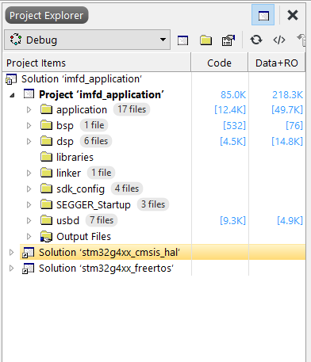
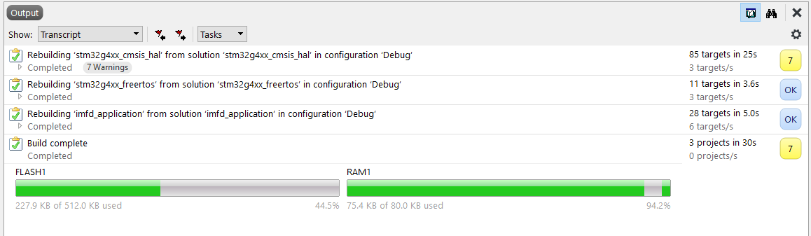
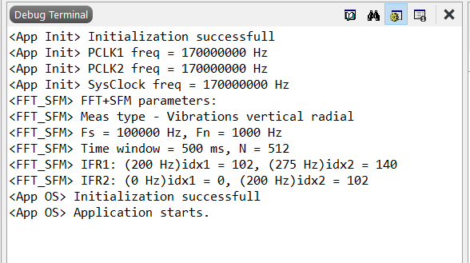

# Induction Motors Fault Detection Firmware Prototype

## Table of content

- [Induction Motors Fault Detection Firmware Prototype](#induction-motors-fault-detection-firmware-prototype)
  - [Table of content](#table-of-content)
  - [What is it?](#what-is-it)
    - [Prehistory](#prehistory)
    - [Online experiment](#online-experiment)
    - [Real-time monitoring device prototype](#real-time-monitoring-device-prototype)
  - [Getting started](#getting-started)
    - [Prerequirements to start](#prerequirements-to-start)
    - [How to start](#how-to-start)
  - [Firmware arcitecture](#firmware-arcitecture)
  - [Algorithm description](#algorithm-description)
  - [How to debug?](#how-to-debug)
  - [Repo structure](#repo-structure)
    - [Main (and one) application project structure](#main-and-one-application-project-structure)
  - [Communication via USB](#communication-via-usb)

## What is it?

### Prehistory

Development of the Real-Time Monitoring System of the Induction Motor Technical Condition was in frame of the PhD research of the repo's founder Morozov Arsenii.
The main goal of the PhD research is development of the new signal processing technique to treat vibration or/and (depends on avialability) current signals from induction motor to extract diagnostic information and make decision about fault condition of the tested motor. FFT+SFM method based on Fast Fourier Transform (FFT) and Statistics of the Fractional Moments (SFM) have been developed and proposed. To test FFT+SFM method it was implemented in prototype of the motor's condition monitoring device. The only one option to test device was so-called "online-experiment". The essence and meaning of the online-experiment described in [separate subsection](#online-experiment). The device was developed in order to test proposed method with respect to online-experiment requirements and specific.

### Online experiment

An experimental study was planned to be conducted under the Erasmus+ grant in 2020, however, due to covid restrictions during mobility under the grant, this study could not be conducted. Measuring units with AD, on which it was planned to conduct an experimental study, are located at the Polytechnic University of Bari (Italy) and the Novi Sad University of Novi Sad (Serbia). Also, due to covid restrictions in 2020-2021, it was not possible to visit these universities in person for the experiment, no longer within the framework of grant mobility. In this regard, it was decided to conduct an experiment online together with the University of Novisad. For this purpose, a stand was developed that allows to interrogate sensors mounted on a measuring unit at Novi Sad University, receive data from these sensors in Kazan in real time via the Internet and "pass" them through a prototype monitoring device implementing the developed methodology.
The setup for online-experiment includes:

1. A measuring unit consisting of: two AD, two accelerometers and a current sensor, as well as an ADC.
2. A personal computer with software No. 1 is designed to configure and survey sensors and transmit data over the Internet to a PC with software 2.
3. A personal computer with software No. 2 is designed to receive data over the Internet, display, saving and transmitting data to the device in real time
4. A prototype of a monitoring device that implements the proposed signal processing technique for diagnosing the technical condition of the AD.

Device prototype interacts with software No.2 which located in special [data_stream_labview repo](https://github.com/morozovars/data_stream_labview).

### Real-time monitoring device prototype

The hardware platform of prototype is [B-G474E-DPOW1 (STM32G474 Discovery)](https://www.st.com/en/evaluation-tools/b-g474e-dpow1.html).
Software of the prototype (firmware) implements proposed FFT+SFM signal processing method and communication over USB with PC.
This repo contains project files, source codes, tools and documentation of the firmware for development of the Induction Motors Fault Detection Monitoring device prototype.
    Current version of the device not interacts with sensors directly, it received sensors data via USB.

## Getting started

### Prerequirements to start

1. You need [B-G474E-DPOW1 (STM32G474 Discovery)](https://www.st.com/en/evaluation-tools/b-g474e-dpow1.html) board. Can be evauluated on other boards with STM32G474RE MCU, but some features may not work as described.
2. PC with Windows/Linux/Mac (last test was on Windows 10, so not guarantee work "out of box" on machines with different operating systems).

### How to start

1. Clone git repository.
2. Load git submodules:
    [sdk/MCU/STM32/STM32CubeG4](https://github.com/STMicroelectronics/STM32CubeG4) - module with libraries, provided by ST Microelectronics for STM32G4 series, such as CMSIS, HAL, USB, FreeRTOS ports, etc.
3. Load and install IDE [SEGGER Embedded Studio (SES)](https://www.segger.com/products/development-tools/embedded-studio/). Last tested version - SEGGER Embedded Studio for ARM v.5.68 (64-bit), Non-commerical license on Windows 10. This IDE can be loaded on offical [SEGGER web-site](https://www.segger.com/downloads/embedded-studio/). It's good idea when getting started load exactly the same version, because sometime IDE's projects not compitable between different versions.
4. Open project *projects/application/application_ses/imfd_application_ses.emProject* in IDE. You should see project structure in *Project Exloprer*:



5. Buid project (Build->Build imfd_application or press F7). It should run building of the main project with depended static libraries (stm32g4xx_freertos, stm32g4xx_cmsis_hal). After building you should see following *Output*:



6. Connect your B-G474E-DPOW1 board to computer. When connected you should observe Mass Storage Device *DIS_G474RE*.
7. Run debug session (Debug->Go or press F5). When device will ber ready for debug you have to see break on *int main(void)* function. Press again F5. You should see following message in *Terminal*:



Also you should observe that LD2,3,4,5 consequently blinking.

## Firmware arcitecture

Firmware arcitecture described in *[docs/IMFD_FW.xlsx](docs/IMFD_FW.xlsx)*

## Algorithm description

Algorithm descibed in a few papers on Russian and English languages, which located in *docs/FFT_SFM/**

## How to debug?

1. Debug system. System supports general debugging with all features supported by IDE: breakpoints, terminal (by printf), watch, callstack, etc. In addition [SEGGER SystemView](https://www.segger.com/products/development-tools/systemview/) can be used to discover RTOS operating.
1. Debug algorithm. System also sends some additional debug data, which obtains on following algorithm states: FFT computation, GMV computation. Sending of these data arrays controlled in *[sources/application/thread_dsp.c](sources/application/thread_dsp.c)* in *process_measurements()* function. Also system support command "CHANGE IFR OF DEBUG GMV" which allow to set another IFR (Information Frequency Range) of the algorithm.

## Repo structure

```C
├── docs
├── projects
 ├─application
 ├─samples
 ├─tests
├── sdk
└── sources
 ├─application
 ├─bootloader
```

- **docs** - documentation: datasheets, app notes, project's documentation
- **projects** - IDE's projects
  - **application** - IDE's projects for application
  - **samples** - samples and examples
  - **tests** - tests (no tests developed yet)
- **sdk** - external components, libraries and tools
- **sources** - source code
  - **application** - source files and configurations of the application
  - **bootloader** - source files and configurations of the bootloader (bootloader development not started yet)

### Main (and one) application project structure

```C
├── projects
 ├─application
  ├─application_ses
  ├─stm32g4xx_cmsis_hal_ses
  ├─stm32g4xx_freertos_ses
```

- **projects** - IDE's projects
  - **application** - IDE's projects for application
    - **application_ses** - Executable main application project. This application dependend on a few (following next) static libraries.
    - **stm32g4xx_cmsis_hal_ses** - Static library with HAL and CMSIS provied by ST Microelectronics for STM32G4 series. This library used files in [sdk/MCU/STM32/STM32CubeG4](https://github.com/STMicroelectronics/STM32CubeG4) submodule.
    - **stm32g4xx_freertos_ses** - Static library with FreeRTOS port on STM32G4 provied by ST Microelectronics for STM32G4 series. This library used files in [sdk/MCU/STM32/STM32CubeG4](https://github.com/STMicroelectronics/STM32CubeG4) submodule.

## Communication via USB

Device communicating thorugh developed, so-called ONECOM protocol, described in *[docs/ONECOM_v.1.0.0.pdf](docs/ONECOM_v.1.0.0.pdf)*.
